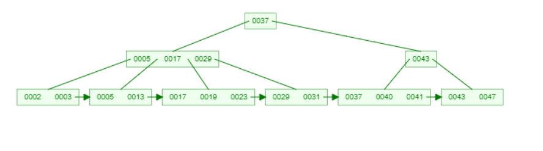
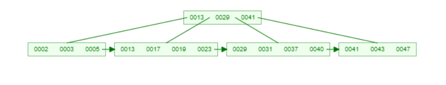

#### Exercício 1. 
**Discutimos alguns impactos da remoção em B-Trees durante as aulas. Suponha que um colega faça a seguinte afirmação. “Remover entradas em B-Trees é super fácil, basta não fazer nada na estrutura e utilizar uma estratégia de remoção virtual. Essa modificação requer modificar uma linha de código e não altera a estrutura do índice”. Você concorda com essa afirmação? Justifique. Em caso de ser possível adotar essa solução, quais seriam os impactos práticos? Seria possível ter efeitos negativos e como minimizá-los?**

*Resposta:*

#### Exercício 2. 
**Suponha que os ponteiros tenham 4 bytes e as chaves tenham 12 bytes. Quantas chaves e quantos ponteiros conseguiremos alocar em um nó de 16.384 bytes?**

*Resposta:*
chave = 12 * x
ponteiro = 4 * (x + 1)

12 * x + 4 * (x + 1) <= 16.384
12x + 4x + 4 <= 16.384
16x + 4 <= 16.384
16x <= 16.380
x <= 1.023,75 (arredonda para baixo)

1.023 chaves e 1.024 ponteiros

#### Exercício 3. 
**Qual é o número mínimo de (a) chaves e (b) ponteiros em uma B(+)-Tree para n = 10 e n = 11?**

*Resposta:*
n = número de chaves
ponteiros = n + 1
número mínimo = mínimo = (n + 1) / 2

| n = 10  |  n = 11 |
| ------- |  ------ |
| ponteiros = 5 | ponteiros = 6 |
| chaves = 4 | chave = 5 |

#### Exercício 4. 
**Se a chave usada na indexação não for única, então é necessário realizar algumas modificações nas operações de inserção, remoção e atualização de uma B(+)-Tree. Quais são essas modificações para a operação de inserção? Dê um exemplo.**

*Resposta:*

#### Exercício 5. 
**Faça o passo-a-passo de inserção dos seguintes elementos em uma B(+)-Tree, para nós de capacidade n = 3. Elementos: {47,2,43,3,41,5,37,13,31,17,29,19,23,40}.**

*Resposta:*

#### Exercício 6. 
**Repita o exercício para n = 5.**

*Resposta:*

#### Exercício 7. 
**Esboce um algoritmo de busca sobre uma B(+)-Tree considerando a busca por uma chave K e o operador de comparador por identidade, exemplo K = [uma chave qualquer].**

*Resposta:*

Basta verificar se a chave e menor ou maior que o nó raiz;

enquanto chave não encontrada:
  Se o valor do nó atual for menor: 	
    vá para direita
  Se for maior
    vá para esquerda
  Senão
    retorne a chave 

#### Exercício 8. 
**Esboce um algoritmo de busca sobre uma B(+)-Tree considerando a busca por uma chave K e o operador de comparador por relação de ordem, por exemplo K > [um valor de chave qualquer].**

*Resposta:*

#### Exercício 9. 
**Esboce um algoritmo de busca sobre uma B(+)-Tree considerando a busca por uma chave K e o operador de comparador por intervalo, por exemplo K > [um valor de chave qualquer de limite inferior] E K < [um valor de chave qualquer de limite superior].**

*Resposta:*